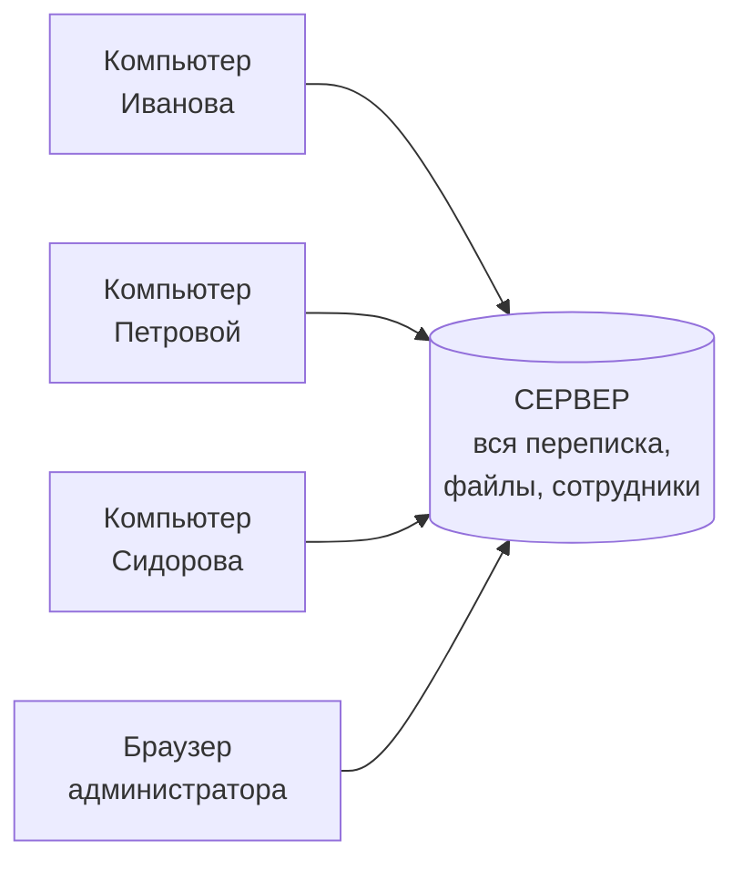
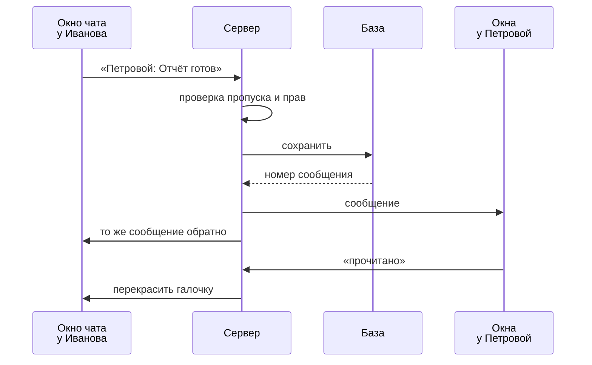
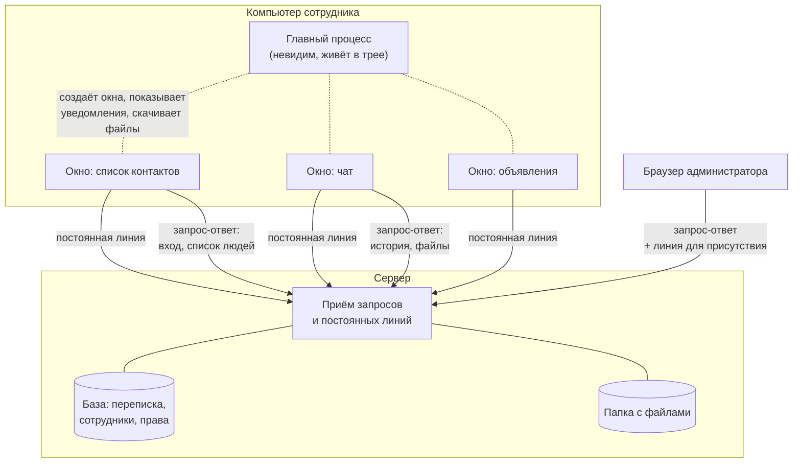

# Как «Искра» работает изнутри

Этот файл объясняет, что происходит между приложением на компьютере сотрудника и сервером — от
момента, когда человек вводит пароль, до момента, когда его собеседник видит сообщение. Без
предварительных знаний о программировании: технические слова вводятся по мере надобности и сразу
объясняются.

Читать подряд не обязательно — оглавление ниже.

- [Из чего всё состоит](#из-чего-всё-состоит)
- [Клиент — это не одна программа, а несколько](#клиент--это-не-одна-программа-а-несколько)
- [Два разных способа связи с сервером](#два-разных-способа-связи-с-сервером)
- [Вход в систему и что такое токен](#вход-в-систему-и-что-такое-токен)
- [Постоянная линия связи](#постоянная-линия-связи)
- [Путь одного сообщения — по шагам](#путь-одного-сообщения--по-шагам)
- [Как открывается чат и подгружается история](#как-открывается-чат-и-подгружается-история)
- [Файлы](#файлы)
- [Статусы «в сети» и «отошёл»](#статусы-в-сети-и-отошёл)
- [Уведомления и счётчики непрочитанного](#уведомления-и-счётчики-непрочитанного)
- [Мелочи, которые видно в интерфейсе](#мелочи-которые-видно-в-интерфейсе)
- [Общая комната, группы и объявления](#общая-комната-группы-и-объявления)
- [Веб-панель администратора](#веб-панель-администратора)
- [Что происходит при обрыве связи](#что-происходит-при-обрыве-связи)
- [Что где хранится](#что-где-хранится)
- [Сводка: кто с кем разговаривает](#сводка-кто-с-кем-разговаривает)

---

## Из чего всё состоит

Две отдельные программы:

**Сервер** — работает на одном компьютере в организации круглосуточно. Он единственный, кто хранит
переписку, файлы и список сотрудников. Все разговоры идут через него: сообщение никогда не летит с
компьютера на компьютер напрямую, даже если люди сидят за соседними столами.

**Клиент** — приложение, установленное у каждого сотрудника. Сам по себе он не хранит переписку и
без сервера показать её не может. Его задача — красиво показать то, что прислал сервер, и отправить
серверу то, что напечатал человек.

Такое устройство называется «клиент-серверным». Смысл в том, что правда — в одном месте. Если бы
переписку хранил каждый компьютер отдельно, при поломке одного из них часть истории терялась бы, а
у двух собеседников легко расходились бы версии одного и того же разговора.

---

## Клиент — это не одна программа, а несколько

Это первое, что стоит понять — без этого дальнейшее выглядит странно.

Приложение сотрудника состоит из **главного процесса** и **окон**.

**Главный процесс** — невидимая часть. У него нет своего окна. Он живёт всё время, пока приложение
запущено, в том числе когда все окна закрыты и виден только значок в трее (в правом нижнем углу
экрана, у часов). Он отвечает за то, что умеет только операционная система: показать всплывающее
уведомление Windows, положить значок в трей, открыть диалог «Сохранить файл как», узнать, давно ли
человек не трогал мышь, создать новое окно.

**Окна** — то, что человек видит. Каждое окно — отдельная страница со своим содержимым:

| Окно | Что показывает |
|---|---|
| Список контактов | Сотрудники по отделам, группы, «Объявления», свой профиль |
| Окно чата | Одна переписка. Открыто три чата — работают три отдельных окна |
| Объявления | Лента объявлений организации |

Окна намеренно **не могут** сами обращаться к операционной системе. Окно не может стереть файл на
диске или запустить программу — даже если бы его содержимое кто-то подменил. Всё, что ему нужно от
системы, оно просит у главного процесса через узкий, заранее оговорённый список просьб: «покажи
уведомление с таким текстом», «открой окно чата с таким человеком», «скачай файл по этой ссылке».

Это защитная мера. Окно показывает текст, пришедший от других людей, а чужому тексту доверять
нельзя. Если бы окно имело полный доступ к компьютеру, вредоносное сообщение могло бы этим
воспользоваться. А так — максимум, что оно может, это попросить главный процесс о чём-то из
короткого списка.

> **Важная деталь, которая понадобится дальше:** к серверу подключается **каждое окно отдельно**.
> Не приложение целиком — именно окно. Если у сотрудника открыт список контактов и два чата, к
> серверу идут три независимых подключения от одного человека. Сервер это понимает и не считает его
> тремя разными людьми.

---

## Два разных способа связи с сервером

Клиент общается с сервером двумя разными способами, и они решают разные задачи. Это ключ ко всему
остальному.

### Способ первый: запрос и ответ

Клиент задаёт вопрос — сервер отвечает — связь закрывается. Как телефонный звонок в справочную:
позвонил, спросил, получил ответ, положил трубку.

Так запрашивается всё, что нужно **однократно и по инициативе клиента**:

- войти в систему;
- получить список сотрудников;
- загрузить историю переписки за вчера;
- найти слово во всей переписке;
- отправить файл на сервер;
- сохранить изменённое имя в профиле.

Технически это тот же способ, которым браузер загружает обычные сайты, — он называется HTTP.

У этого способа есть неустранимый недостаток: **сервер не может заговорить первым**. Он отвечает
только тогда, когда его спросили. А сообщение от коллеги приходит именно по инициативе сервера — в
момент, когда получатель ни о чём не спрашивал. Спрашивать «нет ли мне чего-нибудь?» каждую секунду
— расточительно и всё равно даёт задержку.

### Способ второй: постоянная линия

Клиент один раз дозванивается до сервера, и линия **остаётся открытой** часами. Оба конца могут в
любой момент что-то сказать, не переспрашивая. Как оставленная включённой рация.

Так передаётся всё, что происходит **живо и неожиданно**:

- новое сообщение;
- «собеседник печатает…»;
- кто-то вошёл в сеть или отошёл;
- на ваше сообщение поставили смайлик;
- ваше сообщение прочитали;
- пришло объявление;
- администратор изменил список сотрудников.

Технически это называется WebSocket. Дальше в тексте — «постоянная линия».

**Правило простое:** то, что клиент запрашивает сам, идёт по способу «запрос-ответ». То, что
сервер сообщает по своей инициативе, — по постоянной линии.

---

## Вход в систему и что такое токен

Что происходит, когда сотрудник ввёл логин и пароль:

1. Окно списка контактов отправляет их на сервер запросом «проверь, это наш человек?».

2. Сервер ищет логин в базе. Паролей он **не хранит** — вместо пароля хранится результат его
   математической переработки (её называют хешем). Из этого результата пароль обратно не
   восстанавливается: превращение работает только в одну сторону. Сервер перерабатывает
   присланный пароль так же и сравнивает результаты. Совпали — пароль верный.

   Смысл в том, что даже человек, укравший файл базы, не получит паролей сотрудников.

3. Если всё верно, сервер выдаёт **токен**.

**Токен — это временный пропуск.** Внутри записано, кому он выдан, до какого числа действует, и
стоит подпись сервера. Подпись устроена так, что проверить её может любой, а поставить — только
сервер: он один знает секретный ключ. Подделать пропуск нельзя, а исправить в нём хоть одну букву —
значит сломать подпись, и сервер это сразу увидит.

Дальше пароль больше не нужен. Каждый следующий запрос клиент сопровождает токеном — это как
показывать пропуск на входе, а не заново объяснять охране, кто вы такой. Токен действует **30
дней**, поэтому приложение не спрашивает пароль каждое утро.

Токен хранится на компьютере сотрудника. При выходе из аккаунта он стирается.

> **Важно:** между клиентом и сервером **нет шифрования канала**. Пароль при входе и токен при
> каждом запросе идут по сети открытым текстом. Внутри изолированной локальной сети организации это
> приемлемо. Если сервер доступен откуда-то ещё — перед ним обязательно нужен шифрующий посредник
> (об этом написано в README сервера).

---

## Постоянная линия связи

Сразу после входа окно списка контактов открывает постоянную линию к серверу. При подключении оно
предъявляет токен и сообщает имя компьютера.

Сервер проверяет подпись токена, узнаёт, кто подключился, и **запоминает это подключение в
оперативной памяти** — в список «кто сейчас на связи». Список нигде не сохраняется: при перезапуске
сервера он собирается заново по мере того, как клиенты переподключаются.

Как уже сказано, **каждое окно открывает свою линию**. Открыл сотрудник два чата — стало три линии
от одного человека. Сервер группирует их по сотруднику и по имени компьютера, поэтому в списке
контактов он показан один раз. А если он работает и за рабочим компьютером, и за ноутбуком, коллеги
при наведении курсора увидят имена обеих машин.

Зачем такая сложность? Каждое окно работает самостоятельно: чат сам получает свои сообщения, сам
показывает «печатает…», сам отмечает прочитанное. Это проще и надёжнее, чем гонять всё через одно
подключение и потом раскладывать по окнам вручную.

---

## Путь одного сообщения — по шагам

Иванов пишет Петровой «Отчёт готов». Что происходит:

**1. Окно чата у Иванова** отправляет по своей постоянной линии: «сообщение для сотрудника номер 7,
текст такой-то».

Отправляет **окно чата**, а не список контактов: у окна своя линия, и оно ближе всего к тому, что
человек напечатал.

**2. Сервер проверяет отправителя.** Он не верит тому, что пришло, на слово. Кто отправитель — он
знает сам, из пропуска, предъявленного при подключении. Подставить в сообщение чужое имя нельзя:
это поле сервер просто игнорирует и подставляет своё.

Он также проверяет, что присланные данные вообще имеют правильный вид — что номер получателя это
число, а текст это текст. Раньше этой проверки не было, и одно неправильно составленное сообщение
могло выключить сервер у всей организации. Сейчас такое сообщение молча отбрасывается.

Если сообщение адресовано группе, сервер дополнительно проверяет, состоит ли отправитель в ней.

**3. Сервер сохраняет сообщение в базу.** База — один файл на диске сервера, устроенный как таблица:
кто, кому, что, когда. Сообщение получает свой номер по порядку.

Сохранение идёт **до** отправки получателю. Если бы сначала отправляли, а потом сохраняли, то при
сбое ровно между этими шагами сообщение было бы у собеседника на экране, но пропало бы из истории.

**4. Сервер смотрит, кто сейчас на связи.** Он заглядывает в свой список подключений и находит все
линии Петровой — все её окна на всех её компьютерах.

**5. Сервер отправляет сообщение по этим линиям.** Плюс — обратно самому Иванову, во все **его**
окна. Это нужно, чтобы отправленное появилось в чате единообразно и с настоящим номером и временем,
присвоенными сервером. Заодно, если Иванов работает с двух компьютеров, отправленное с одного сразу
видно на другом.

**6. Окна у Петровой получают сообщение и решают, что с ним делать:**

- если открыто окно чата именно с Ивановым — сообщение появляется в переписке;
- окно списка контактов в это же время получает то же сообщение и просит главный процесс показать
  всплывающее уведомление Windows;
- если окно чата с Ивановым открыто и активно (человек прямо сейчас в него смотрит), уведомление не
  показывается — оно было бы лишним.

**Если Петрова не в сети,** шаги 4–6 просто ни к чему не приводят: подключений нет, отправлять
некуда. Сообщение уже лежит в базе и дождётся её — она увидит его при следующем входе, а счётчик
непрочитанного покажет, сколько накопилось.

**7. Петрова прочитала.** Когда она кликает в окне чата или прокручивает переписку, её окно через
несколько секунд сообщает серверу: «сообщения от Иванова до такого-то момента прочитаны». Сервер
помечает их в базе и сообщает Иванову — у него серая галочка становится синей.

Отметка «прочитано» существует **только для личной переписки**. В группах и общей комнате её нет:
там читателей много, и «прочитано» ни о чём не говорило бы.

---

## Как открывается чат и подгружается история

Двойной клик по сотруднику в списке контактов:

1. Окно списка просит главный процесс: «открой окно чата вот с этим человеком».
2. Главный процесс создаёт новое окно и передаёт ему, с кем говорим и пропуск для сервера.
3. Новое окно открывает **свою** постоянную линию — чтобы получать новые сообщения этой переписки.
4. Одновременно оно запросом «вопрос-ответ» просит историю за сегодня и рисует её.

**Почему только за сегодня.** Чат каждый день начинается с чистого листа — так окно открывается
мгновенно, а не тянет тысячи старых сообщений. Ничего при этом не теряется: вся переписка лежит на
сервере, кнопка «История» открывает панель с месяцами, днями и поиском по всей переписке.

**Подгрузка порциями.** Сервер отдаёт историю кусками по **200 сообщений**. Если пришло ровно 200,
клиент понимает, что дальше может быть ещё, и подгружает следующую порцию, когда человек прокручивает
вверх. Так открытие переписки, которая ведётся годами, не подвешивает и клиент, и сервер.

**Поиск** — тоже обычный запрос: клиент отправляет слово, сервер ищет по базе и возвращает
совпадения. Поиск не различает заглавные и строчные буквы, в том числе в русском тексте — для этого
на сервер добавлена отдельная функция сравнения, потому что встроенная в базу умеет только латиницу.

**Дни считаются по часам того компьютера, за которым сидит человек.** Клиент сообщает серверу свой
часовой пояс при каждом запросе истории. Иначе, если сервер стоит в другом поясе, граница суток
разъезжалась бы с тем, что человек видит на своих часах.

---

## Файлы

### Отправка

Отправка файла — **две отдельные операции**, и это важно.

**Сначала** файл целиком уходит на сервер обычным запросом. Сервер:

- проверяет расширение. По умолчанию запрещено то, что Windows запускает двойным кликом (`exe`,
  `bat`, `cmd`, `msi`, `vbs`, `js`, `lnk` и подобное). Список и режим меняет администратор в
  веб-панели. Смысл — чтобы нельзя было прислать «документ.exe» и рассчитывать, что кто-то по
  ошибке его запустит;
- проверяет размер. По умолчанию **50 МБ**, тоже настраивается;
- сохраняет файл под техническим именем: время + случайный набор символов + исходное имя. Случайная
  часть нужна, чтобы два файла с одинаковым названием не затёрли друг друга, а исходное имя
  очищается от символов, которыми можно было бы выбраться из папки для загрузок;
- отвечает: вот ссылка на сохранённый файл, вот его размер.

**Потом** клиент отправляет обычное сообщение, в котором указана эта ссылка.

Поэтому все выбранные разом файлы и подпись к ним — **одно сообщение и один пузырь** в переписке, а
не россыпь отдельных.

Побочный эффект такого устройства: если человек выбрал файл, тот загрузился, а сообщение так и не
отправили — файл остаётся на диске сервера, но ни в одной переписке на него нет ссылки. В разделе
«Файлы» веб-панели такие помечены как «без сообщения», их можно удалять не глядя.

### Скачивание

Здесь есть тонкость, ради которой сделан лишний шаг.

Обычная ссылка не умеет предъявлять пропуск — у неё есть только адрес. Раньше пропуск подставляли
прямо в адрес, и это было плохо: адреса записываются в журналы серверов и посредников, и утечка
такого журнала означала бы утечку 30-дневного пропуска всех сотрудников.

Поэтому теперь:

1. Клиент просит **отдельный одноразовый пропуск** именно на этот файл.
2. Сервер выдаёт пропуск, действующий **60 секунд** и годный только для этого файла.
3. Клиент передаёт адрес с этим коротким пропуском главному процессу — скачивание идёт через него,
   а не через окно. Иначе Windows открывал бы пустое вспомогательное окно, которое потом зависало.
4. Главный процесс скачивает файл, показывая в переписке кольцо с процентами, а по завершении —
   зелёную галочку.

Шестидесяти секунд хватает, чтобы начать скачивание; на уже идущую передачу истечение пропуска не
влияет. А попади такой адрес в журнал — он бесполезен.

Сохраняется файл под своим настоящим именем: сервер передаёт его отдельно от технического имени на
диске.

**Удаление файла администратором** стирает его с диска, но **не трогает переписку**. Сообщение
остаётся, а на месте файла клиент показывает «файл удалён с сервера» — это осознанное решение: мы
чистим диск, а не переписываем историю.

---

## Статусы «в сети» и «отошёл»

Три состояния: зелёный — за компьютером, жёлтый — отошёл, серый — приложение не запущено.

**Серый** определяется сам собой: нет ни одного подключения — человека нет.

**Зелёный и жёлтый** различает клиент, а не сервер, потому что только клиент может спросить у
Windows, давно ли человек трогал мышь или клавиатуру. Учитывается активность **во всей системе**, а
не только в мессенджере: человек, который час работает в другой программе, считается на месте.

Каждые **15 секунд** главный процесс спрашивает у Windows время простоя и сообщает результат всем
своим окнам, а каждое окно отправляет его серверу по своей линии.

Почему каждое окно, а не одно? Раньше статус сообщало только окно списка контактов. Остальные
подключения молчали, и сервер считал их вечно активными — из-за чего статус «Отошёл» не наступал
вообще, пока открыт хоть один чат. Одно активное подключение перебивало все остальные.

Сервер собирает статус человека из всех его подключений по правилу: **активен хотя бы где-то —
значит активен**. Отошёл он тогда, когда отошёл на всех своих компьютерах, и время отсчитывается от
самого раннего из них.

**Когда рассылается присутствие.** Раньше — на каждый 15-секундный доклад каждого сотрудника. При
200 сотрудниках это 200 рассылок каждые 15 секунд, каждая всем 200 адресатам, хотя статусы почти
всегда не менялись. Сейчас сервер сравнивает новую картину с предыдущей и рассылает **только при
реальном изменении**: кто-то пришёл, отошёл или отключился. Вновь подключившемуся окну текущая
картина отправляется отдельно.

> **На виртуальной машине** статус «Отошёл» может не наступать: интеграция мыши между основной и
> гостевой системой сама двигает курсор, и Windows считает это активностью. Это особенность
> виртуальной машины, а не ошибка приложения.

---

## Уведомления и счётчики непрочитанного

**Всплывающие уведомления Windows** показывает главный процесс — окно этого не умеет. Схема такая:
окно списка контактов получает сообщение по своей линии и просит главный процесс показать
уведомление. Клик по уведомлению открывает нужный чат.

Главный процесс сам решает, показывать ли: если нужное окно уже открыто и активно, уведомление
подавляется.

**Счётчики непрочитанного** живут в главном процессе — он один видит картину целиком: какие окна
открыты, какое активно. Окно списка контактов только рисует то, что он сообщил.

Но память главного процесса исчезает при закрытии приложения. Поэтому при каждом запуске клиент
отдельно спрашивает у сервера, сколько личных сообщений осталось непрочитанными, и «заряжает» этим
счётчики. Сервер знает это точно: отметка о прочтении хранится в базе. Без этого шага пропущенное,
пока приложение было закрыто, никак не отражалось бы на значках.

---

## Мелочи, которые видно в интерфейсе

**«Печатает…»** — единственное, что **нигде не сохраняется**. Клиент отправляет уведомление о
наборе не чаще раза в несколько секунд, сервер просто пересылает его собеседникам, никуда не
записывая. Отдельного сигнала «закончил печатать» нет: у получателя пузырёк с точками гаснет сам,
если новых уведомлений не приходило пару секунд.

В группе такое уведомление уходит только участникам — иначе посторонний, подставив номер группы, мог
бы по ответу узнать её состав.

**Смайлики-реакции.** Одна реакция от человека на сообщение: повторный клик по той же снимает её,
клик по другой — заменяет. Сервер рассылает не изменение, а **весь актуальный набор** реакций
сообщения — так проще и надёжнее, а реакций на одном сообщении обычно немного.

**Ответ на сообщение.** Цитата — не ссылка на оригинал, а **снимок** его автора и текста, сделанный
сервером в момент отправки ответа. Иначе цитата ломалась бы, когда оригинал слишком старый и не
загружен в окно.

**Список сотрудников** окно опрашивает раз в 20 секунд. Чтобы не гонять один и тот же список
впустую, применяется приём с «отпечатком»: сервер вместе со списком присылает его версию, клиент
при следующем опросе сообщает, какая версия у него есть, и если ничего не изменилось, сервер
отвечает коротким «изменений нет» вместо всего списка. Плюс к этому при любом изменении сервер сразу
сообщает об этом по постоянной линии — так что двадцатисекундный опрос это лишь подстраховка.

---

## Общая комната, группы и объявления

**Общая комната** — переписка, видная всем. Сообщение туда сервер рассылает по всем подключениям.

**Группы** может создать любой сотрудник под свою задачу. Технически группа — та же комната, просто
с другим внутренним обозначением, поэтому она бесплатно получила всё, что уже было сделано для
общей комнаты: историю, поиск, разбивку по дням, реакции, ответы.

Разница в проверках: сообщение группы сервер рассылает **только её участникам**, а прежде чем
принять сообщение, проверяет, состоит ли отправитель в ней. Переименовать группу, менять состав и
удалять может создатель или администратор; выйти самому можно всегда.

Если из группы вышел последний участник, группа удаляется — писать в неё уже некому. Переписка при
этом остаётся в базе.

**Объявления** — единственное, что отправляется не по постоянной линии, а обычным запросом: это
разовое действие по инициативе человека. А вот получают его все подключённые уже по постоянной
линии, как и обычные сообщения. Отправлять может тот, кому выдано право «Рассылки».

---

## Веб-панель администратора

Веб-страница, которую сервер отдаёт по своему адресу. Отдельная программа не нужна — достаточно
браузера. Сотруднику она бесполезна: без права «Админка» она сразу об этом сообщает.

Работает так же, как клиент: тот же вход, тот же пропуск, те же запросы к серверу. Постоянную линию
она тоже открывает — но только чтобы показывать, кто сейчас в сети, и чтобы самой быть видимой в
списке подключений под именем «Веб-панель администратора». Приложение это учитывает: человеку,
который «в сети» только через веб-панель, написать нельзя — у панели нет интерфейса переписки, и
сообщение он бы просто не увидел.

**Права никогда не проверяются на стороне браузера.** Панель может спрятать кнопку, но решает всё
сервер, при каждом запросе, сверяясь с базой. Спрятанная кнопка — удобство, а не защита: тот, кто
отправит запрос в обход интерфейса, получит отказ. И наоборот — выданное или отобранное право
действует сразу, без перезахода.

---

## Что происходит при обрыве связи

Сеть моргнула, сервер перезапустили, ноутбук ушёл в сон — постоянная линия рвётся.

Каждое окно замечает это самостоятельно и пытается подключиться заново. Промежутки между попытками
**растут**: 2 секунды, потом 3, потом 4,5 и так далее до 30 секунд. Смысл в том, что при коротком
сбое связь восстановится почти мгновенно, а при выключенном на ночь сервере клиент не будет всю
ночь долбиться в него каждые две секунды.

Если за 5 секунд подключиться не удалось, появляется окно «Соединение с сервером потеряно» с
кнопками «Повторить» и «Выйти». Как только связь восстанавливается, оно закрывается само.

**При выключении компьютера** попытки переподключения прекращаются: сеть на выключении отваливается
раньше приложения, и без этого каждое окно в последние секунды жизни успевало бы открыть новый
сокет и нарисовать окно с ошибкой поверх экрана выключения.

**Что теряется при обрыве.** Ничего из переписки: она вся в базе на сервере. Теряется только то, что
и не хранилось, — «печатает…» и информация о том, кто был в сети в этот момент. После
переподключения клиент запрашивает свежую картину.

**Если сервер перезапустили,** пропуска остаются действительными — их проверка не требует ничего,
кроме секретного ключа, а ключ хранится в базе. Заново входить не нужно. Обнуляется только счётчик
«в сети с такого-то времени», потому что он живёт в оперативной памяти.

---

## Что где хранится

**На сервере, в файле базы:** сотрудники, отделы, переработанные пароли, права, группы и их состав,
вся переписка, объявления, реакции, отметки о прочтении, настройки, секретный ключ для подписи
пропусков.

**На сервере, в папках:** присланные файлы (`uploads/`), журналы событий (`logs/`).

**На сервере, только в оперативной памяти** — исчезает при перезапуске: кто сейчас подключён, кто
активен и кто отошёл, счётчики неудачных попыток входа.

**На компьютере сотрудника:** пропуск, своё имя и настройки приложения, свёрнутые отделы, метки
«докуда я дочитал». Переписка на компьютере сотрудника **не хранится** — каждое открытие чата
запрашивает её у сервера заново.

**В памяти главного процесса** — исчезает при закрытии приложения: счётчики непрочитанного (при
запуске восполняются с сервера).

---

## Сводка: кто с кем разговаривает

**Три правила, которые объясняют почти всё устройство:**

1. **Сервер — единственный источник правды.** Клиент ничего не решает и почти ничего не помнит. Он
   показывает то, что прислал сервер.

2. **Клиент никогда не верит сам себе, а сервер никогда не верит клиенту.** Кто отправитель, есть ли
   право, состоит ли человек в группе — решает сервер, по данным из базы, при каждом обращении.

3. **Что запрашивают — идёт запросом; что случается само — приходит по постоянной линии.**

---

Технические подробности по каждой части — в [README сервера](mini-messenger/README.md) и
[README клиента](desktop-client/README-desktop-client.md). Причины конкретных решений разобраны в
комментариях прямо в коде, рядом с тем местом, к которому относятся.
